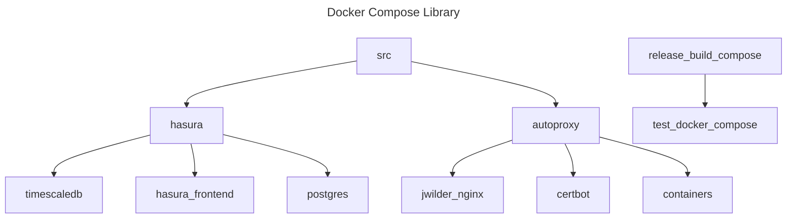

<!-- markdownlint-disable MD041 -->
<!-- markdownlint-disable MD012 -->

# docker-compose library

A collection of useful docker-compose stacks for DevOps practices.  This is a personal collection and is by no means production-ready.

Consider all these stacks as-is.  This project is maintained actively but is not used for any specific purpose.

## Binary Distribution

### Supported Platforms

> [!IMPORTANT]
>
> v0.1.1:
> Current Release Notes:

## Initial Draft

* GraphQL Hasura
* Auto Proxy

## Platforms

* docker-compose 2.0

## Index

| Command | Purpose |
| -- | -- |
| timescale-hasura |  Timescaledb and Hasura with Postgres |
| pgadmin-postgres-proxy-hasura | Auto SSL Proxy with Hasura, PGAdmin and Postgres|
| ansible-vault | Ansible Vault stack |

# Logical Diagram

<!-- github feature -->
<!-- markdownlint-disable MD046 -->

